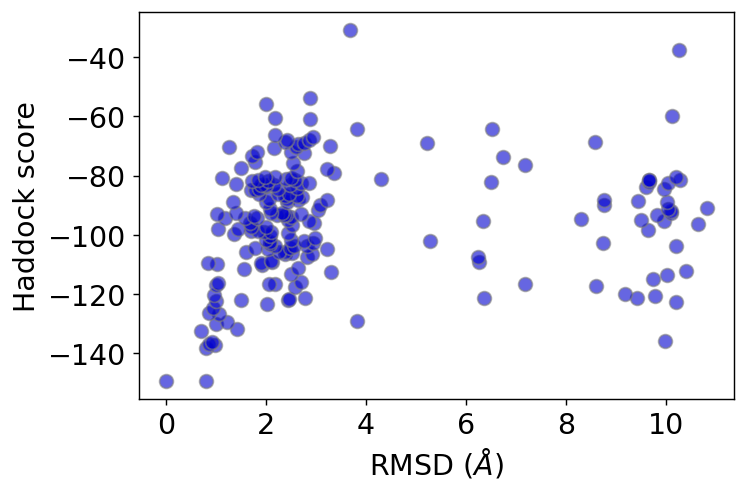

# docking
A set of molecular docking tools and analysis

A publication: [KRAS docking](https://www.pnas.org/doi/10.1073/pnas.2006504117)

Docking program: [Haddock](https://www.bonvinlab.org/software/haddock2.4/)

The notebook uses the Haddock [protein-protein example](https://www.bonvinlab.org/education/HADDOCK-protein-protein-basic/), yielding the plot:

